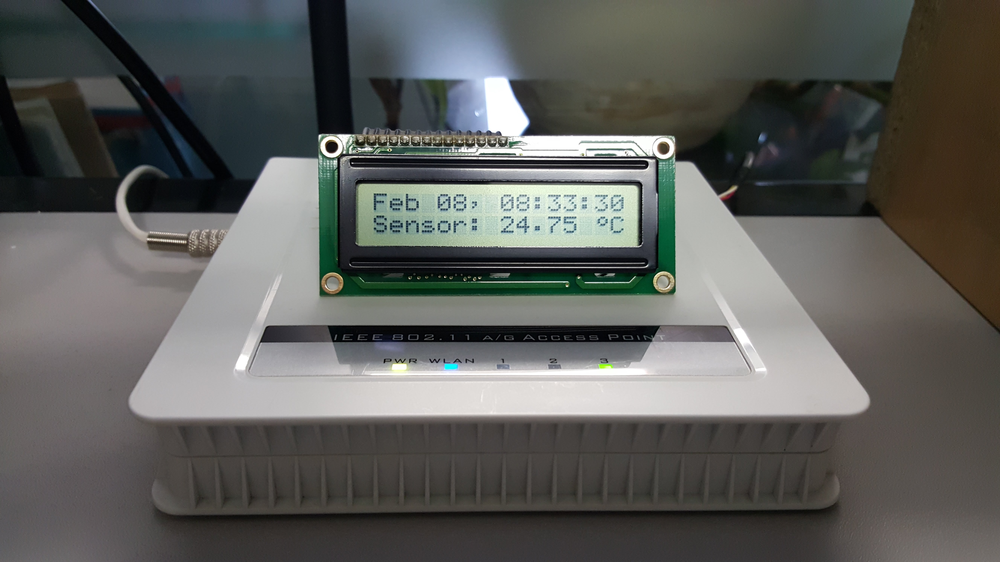
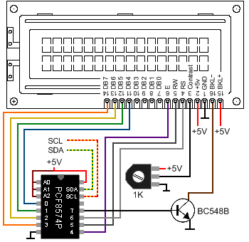
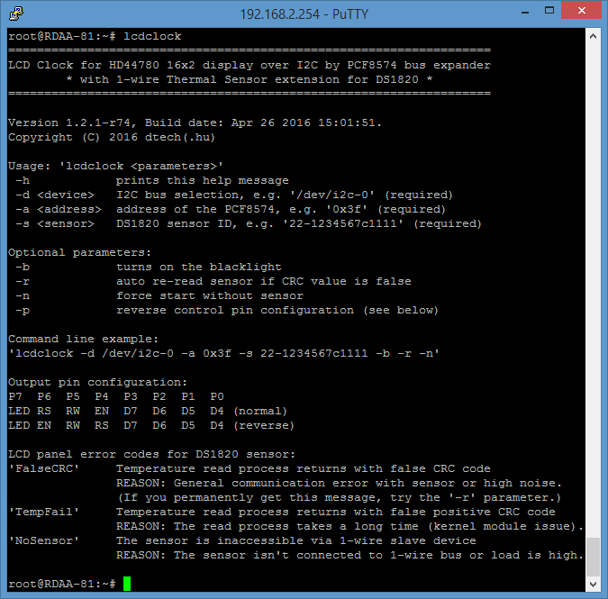

# LCDclock
LCD Clock for HD44780 16x2 display over I²C by PCF8574 bus expander with 1-wire Thermal Sensor extension for DS1820

## Developement information

__Source author:__ Gábor Deé (dtech),\
__License:__ GNU General Public License v2.0,\
__Dependent packages:__ kmod-i2c-gpio-custom, kmod-w1-gpio-custom, kmod-w1-slave-therm.

## LCDclock on a modified Wistron RDAA-81 with OpenWrt



## HD44780 LCD panel and PCF8574 schematics on I²C bus



## Console parameters



## SysV init script configuration (/etc/config/lcdclock)

Enable (1) or disable (0) LCDclock service:
```
	option 'enabled' '1'
```

Set I²C bus and device address of PCF8574:
```
	option 'device' '/dev/i2c-0'
	option 'address' '0x3f'
```

Enable (1) or disable (0) LCD blacklight:
```
	option 'blacklight' '1'
```

Set DS1820 sensor address on 1-wire bus:
```
	option 'sensorid' '22-1234567c1111'
```

Enable (1) or disable (0) auto sensor re-read if it's failed:
```
	option 'autoretry' '1'
```

Enable (1) or disable (0) start without DS1820 sensor:
```
	option 'nosensor' '0'
```

LCD normal (1) or reverse (0) mode wiring (swap EN and RS pins):
```
	option 'reverse' '0'
```

## Changelog:

__v1.2.1-r74 - 2016-04-26__
- Mod: required and optional parameters reorganized
- Mod: add reverse order display wiring support
- Mod: enable force start without thermal sensor

__v1.2.0-r71 - 2016-02-08__
- Mod: 2-lines support added and dropped 1-line display (it supports 16x2 only!)
- Mod: remove obsolated parameters and config options (like: '-w'/'wide')
- Mod: change temperature read interval to 30 seconds
- Mod: from this version the program doesn't work without DS1820 sensor

__v1.1.7-r54 - 2013-03-18__
- Fix: LCD panel initialization fixed (wait after clear)

__v1.1.6-r53 - 2013-02-26__
- New: 16x1 LCD panel support added ('-w' parameter)

__v1.1.5-r51 - 2012-12-05__
- New: sensor auto re-read parameter added
- Mod: leap second calculation reimplemented for sensor read loop
- Fix: LCD panel initialization function fixed

__v1.1.4-r47 - 2012-11-23__
- New: add sensor error reports on LCD panel
- Fix: removed temperature re-check loop (error report)
- Fix: exit function removed if the sensor will be inaccessible
- Mod: the first temperature read set to :00 second (delay +20 secs)

__v1.1.3-r45 - 2012-10-25__
- Fix: memory allocation issue while DS1820 sensor reading

__v1.1.2-r43 - 2012-10-09__
- New: add support for DS1820 thermal sensor over 1-wire (optional)

__v1.0-r27 - 2012-09-03__
- Fix: custom I2C kernel module dependency added
- New: blacklight control parameter added
- New: init.d and uci configuration file added

__v1.0-r24 - 2012-09-01__
- New: Initial release

__Copyright (C) 2016 dtech(.hu), [http://openwrt.dtech.hu/projects/LCDclock/](http://openwrt.dtech.hu/projects/LCDclock/).__
